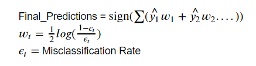

# Cognitive Distortions
Project work by: Yisroel Len
## Problem Statement
As of 2019 [the number of psychological issues among teens is on the rise](https://www.mentalhealthamerica.net/issues/state-mental-health-america) and disturbing, to say the least. The purpose of this project is to help working therapists save time and increase effectiveness by identifying the cognitive distortions that are so common amongst people with depression, anxiety, anger management and many other basic disorders. The [categories of distortions](http://www.pacwrc.pitt.edu/curriculum/313_MngngImpctTrmtcStrssChldWlfrPrfssnl/hndts/HO15_ThnkngAbtThnkng.pdf) that will be used are the ones described by Dr. David Burns in his book, ["Feeling Good, the new mood therapy"](https://feelinggood.com/). This is a well known and well researched categorization of the possible errors in thinking, that is relied upon by psychologists in Cognitive Behavioral Therapy. We will attempt to collect as many possible examples of negative "thoughts" or "thoughts" that indicate negative emotions. These will then be used to attempt to predict irrationality in an actual therapy session. This sort of identification would ideally be used as a method for helping therapists discern areas for future analysis. It would highlight and return the relevant sections to the therapist and client for further investigation. To be clear we're NOT going to identify which irrationality it is, rather simply whether or not it is irrational.

## Executive Summary
When we first started this project we were aiming to find examples of irrational thoughts to train my models, however we were unable to find enough to build anything reliable. During this exploration process we did manage to collect a couple of things that would be useful later on. First, we found a large amount of data for classifying emotion and negativity. Second we did manage to assemble a small collection of irrational thoughts which we thought would be useful to test the final model on. Going back to the first point, we have some background in Cognitive Behavioral Therapy's techniques and methodology. We know that in general higher levels of negativity results in greater levels of irrationality. So essentially, we gathered two types of data. 
- 1) Whether the sentence being spoken was negative at all, regardless of the speaker's actual emotions. 
- 2) Whether or not there was negative emotion in the speaker's sentence, which is more specific. 

All the data that was gathered is in the table below with their relevant links:

**Training Data**

|Basic Description|Source|
|:---|:---|
|Positive and Negative sentences. |[Kaggle Positive and Negative Sentences](https://www.kaggle.com/chaitanyarahalkar/positive-and-negative-sentences)|
|1,600,000 tweets examined based on emoticons on a negative-positive scale of 0-4. |[Tweet Emoticon Emotional Classifier](https://www.kaggle.com/kazanova/sentiment140)|
|An emotional analysis dataset that was gathered manually.|[Sentiment Analysis: Emotion in Text from DataWorld](https://data.world/crowdflower/sentiment-analysis-in-text)|
|A second emotional analysis dataset. |[Emotion Classification](https://www.kaggle.com/eray1yildiz/emotion-classification)|
|An emotional analysis based on words. |[Word Based Emotion Classification](https://www.kaggle.com/iwilldoit/emotions-sensor-data-set)|

**Testing Data**

|Basic Description|Source|
|:---|:---|
|A short back and forth between a therapist and client|[Interpretations of a Counselour in Training](http://counselingexaminer.org/counseling-transcription-interpretations-of-a-counselor-in-training/#more-2487)|
|A full therapy session with the therapist's commentary|[Cognitive Behavioral Therapy Transcript](https://www.psychotherapy.net/data/uploads/5113d623c0a74.pdf)|
|Examples of irrational and rational thoughts|[Put Together by Yisroel Len](https://docs.google.com/spreadsheets/d/1nbTu0bUTqk0kv-lAE-Yvt4aI8XSbaolIbv9mNpgkCII/edit?usp=sharing)|

 Since irrationality is something that requires context we wanted to train my data with larger n_grams and attempt to capture that "context". However we knew there was going to be a big issue with this whole idea in the first place, which we will describe and then address. We're using negativity data to predict irrationality. Meaning it will falsely predict that something is irrational very frequently when in fact it's just negative (High rate of False Negatives). Solution: Build several models that will make predictions, give them a weight based on how accurate they are at forecasting, and create a final prediction based off those weights. The formula that we will use for this is similar to the one used in the AdaBoosting models. Thanks to, Boom Devahastin Na Ayudhya, for helping nail the mathematical part of this down. This is what it will look like:  
 

The testing data, which we gathered, is pretty evenly distributed between irrational and rational so our baseline model was 53.7%. The models that were used are Logistic Regression, Naive Bayes, Random Forest, Extra Trees, and the AdaBooster Classifier. They were chosen for their easily customizable regularization parameters, which were heavily relied upon to bring down issues with overfitting.

## Conclusions
After putting everything together the final model had an accuracy score of 63.2% which is ten percent better than the baseline model. This seems to indicate that negativity does in fact seem to be an okay predictor of irrationality. It might be a useful tool in a therapy session but it's inability to properly predict 36.8% of the data is concerning. This might be useful for a quick glance at a therapy session but there are too many failed predictions to use the model for anything extensive. This is especially true considering the following: We labeled the tesing data ourselves and despite our experience in the area of Cognitive Behavioral Therapy, specifically experience in recognizing irrational thoughts, We are not therapists and have no degree in psychology. Also in the data processing stage, all the emotion data was separated into the following two categories.  
1) Negative Emotions (ex: anger, sadness, fear)  
2) Non-Negative Emotions (ex: neutral, happy, surprise)  
This prevented any sort of multiclassification analysis and it's possible to have more than one emotion at the same time. We would love to be able to test this model on data gathered by licensed therapists which would have more extensive examples as well as more accurate ones.

## Project Table of Contents
**Code**:  
- Follow the numbers in the file and it should be pretty clear. The 4th code file was a proof of concept and demonstrates a practical implementation of the models. 

**Data**:
- Training Data: Cleaned and Uncleaned versions. There was one file that remained in the Uncleaned section because it did not need to be cleaned. That was the `Andbrain_DataSet.csv`.
- Testing Data: Cleaned and Uncleaned versions. Contains proof of concept audio files as well. 

**Final_Models**:  
- Contains the pickled version of my final models as well as a .py file to implement them.

**Images**:
- Images for visualization purposes